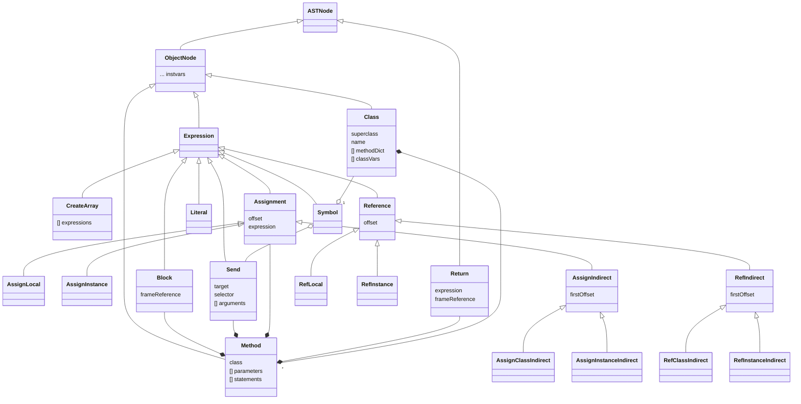

```mermaid
classDiagram
ASTNode <|-- ObjectNode
ObjectNode <|-- Class
ObjectNode <|-- Method
ObjectNode <|-- Expression
Expression <|-- CreateArray
Expression <|-- Assignment
Assignment <|-- AssignLocal
Assignment <|-- AssignInstance
Assignment <|-- AssignIndirect
AssignIndirect <|-- AssignClassIndirect
AssignIndirect <|-- AssignInstanceIndirect
ASTNode <|-- Return
Expression <|-- Send
Expression <|-- Symbol
Expression <|-- Literal
Expression <|-- Reference
Expression <|-- Block
Block : frameReference
Reference <|-- RefLocal
Reference <|-- RefInstance
Reference <|-- RefIndirect
RefIndirect <|-- RefClassIndirect
RefIndirect <|-- RefInstanceIndirect
CreateArray : [] expressions
Block --* Method
Send --* Method
Send : target
Send : selector
Send : [] arguments
Symbol o-- Send
Assignment : offset
Assignment : expression
Assignment --* Method
AssignIndirect : firstOffset
Reference : offset
RefIndirect : firstOffset
Return : expression
Return : frameReference
Return --* Method
Method : class
Method : [] parameters
Method : [] statements
Class : superclass
Class : name
Class : [] methodDict
Class *-- "*" Method
Class --o "1" Symbol
Class : [] classVars
ObjectNode : ... instvars
```
