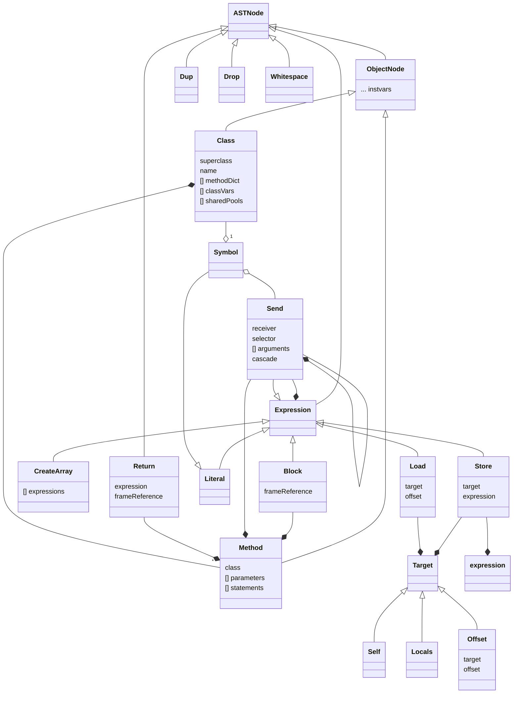
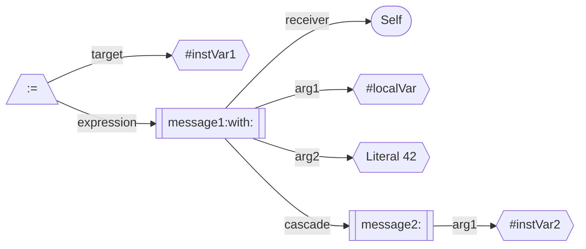
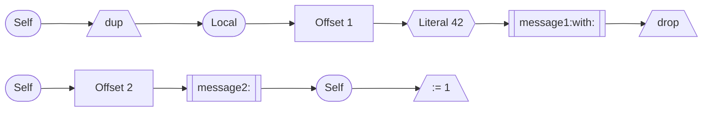

##  AST Classes
The AST Classes serve many purposes:
 1. They capture the structure of methods and blocks
 2. They know how to linearize themselves into a sequence of low level operations so they can be interpreted
 3. They know how to generate assembly code for an idealized machine.



### AST Methods

#### `linearize: stream`
This is used to turn the tree structure into a sequence of objects to reflect efficient execution. For example the compiler would convert:
```smalltalk
instVar1 := self message1: localVar with: 42; message2: instVar2
```
into:


This gets linearized into:

